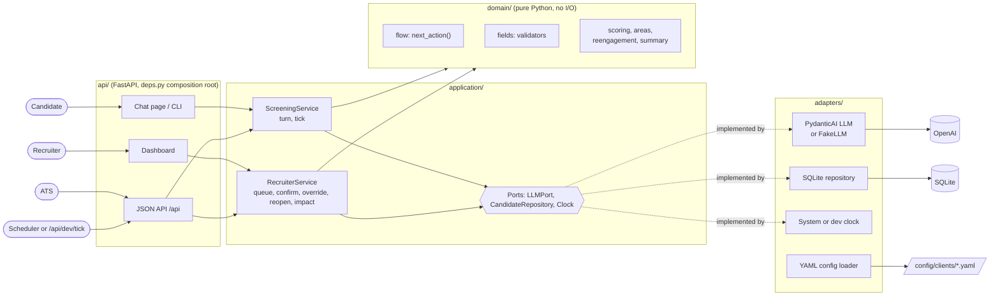

# screening-ai-agent

A messaging agent that screens delivery-driver applicants for a client, and a dashboard where recruiters follow each candidate to an outcome. Agent behavior is specified in [`docs/process_design.md`](docs/process_design.md); vocabulary in [`CONTEXT.md`](CONTEXT.md).

## Setup

### Prerequisites

- [uv](https://docs.astral.sh/uv/) (it installs Python 3.12 if needed)
- [Task](https://taskfile.dev/)
- An OpenAI API key, only for the real LLM. Without one, the app runs on the FakeLLM.

### 1. Install

```
task dev:install
```

### 2. Configure (optional)

```
cp .env.example .env
```

Leave `LLM_MODEL` empty to run on the FakeLLM: no API call, but no language understanding either, so type canonical values (`yes`, `no`, `shared` for a shared vehicle, `Ana López`). To screen in free text, set:

```
LLM_MODEL=openai:gpt-6-luna
OPENAI_API_KEY=sk-...
```

`.env` is never committed. The other variables are documented in [`.env.example`](.env.example).

### 3. Run

```
task dev:run
```

- Candidate chat: http://localhost:8000/chat
- Recruiter dashboard: http://localhost:8000/dashboard
- API docs: http://localhost:8000/docs

`task dev:cli` runs the same screening in the terminal.

### Or in a container

With [Podman](https://podman.io/) and no Python setup on the host (`docker compose` works too, Compose v2.24 or later):

```
task container:up      # build and start, then http://localhost:8000/chat
task container:down    # stop; the database stays in the screening-data volume
task container:reset   # stop and delete the volume (after a schema change)
```

The container reads `.env` when present and keeps `DEV_ROUTES=false` unless `.env` enables it.

## Commands

`task` alone lists every task.

| Command | What it does |
|---|---|
| `task dev:install` | Install dependencies with uv |
| `task dev:run` | Web app with auto-reload |
| `task dev:cli` | Screening in the terminal |
| `task dev:test` | pytest, FakeLLM only (args after `--`, e.g. `task dev:test -- tests/domain`) |
| `task dev:smoke` | Scripted screening against the real LLM, printing each extraction, reply and token usage |
| `task dev:evals` | LLM-played personas against the real LLM, written to `samples/conversations/` |
| `task dev:format` / `task dev:lint` / `task dev:lint:fix` | ruff |

`CLIENT_ID` selects the client config in `config/clients/` (default `grupo_sazon`). `DATABASE_URL` defaults to `sqlite:///data/screening.db`; delete `data/*.db` when the schema changes.

### Demo the Nudges and the deadline

Set `DEV_ROUTES=1` in `.env` and run `task dev:run`. The app then reads the time from a dev clock (the system time plus an offset), and `POST /api/dev/tick` with `{"hours": 1}` moves it forward and runs the sweep; try it from http://localhost:8000/docs. Start a screening in the chat, answer the greeting, then tick by 1, 19, 28 and 24 hours: the chat shows the three Nudges, and the candidate ends Abandoned on the dashboard (Qualified to review if only the recap was left). Without `DEV_ROUTES` the route does not exist.

### Evals and sample conversations

`task dev:evals` plays ten personas (`evals/personas.py`) against the real agent, in parallel, each on its own in-memory database and fixed clock; `task dev:evals -- frustrated silent` runs only those. gpt-6-luna plays the candidate from the persona's profile and judges the run. It exits non-zero when a code check fails. It is never part of `dev:test`.

Read the results in [`samples/conversations/`](samples/conversations/README.md): the index lists each persona's outcome, code checks and judge scores; each `<persona>.md` has the profile, the outcome and flags, the failed checks, the judge's scores, the recruiter summary and the timed transcript.

## Architecture



A turn: input guardrails → LLM extraction (structured output, temperature 0) → validation in code → state update → `next_action()` → LLM reply for that action → output guardrails → persist. The LLM understands and phrases; code decides.

```
app/
  domain/        pure Python: models, fields (validators), flow (next_action), areas, scoring, reengagement, summary
  application/   ports.py (LLMPort, CandidateRepository, Clock) + screening_service.py + recruiter_service.py
  adapters/      llm/ (fake_llm.py, pydantic_ai_llm.py, prompts/), persistence/ (SQLModel + SQLite), config/yaml_loader.py, clock.py
  api/           deps.py (composition root), json_routes.py (/api), pages.py (HTML + HTMX), dev_routes.py (DEV_ROUTES only)
  web/templates/ Jinja2 pages and partials
  cli.py         terminal chat
```

## Key design decisions

- **Code decides, the LLM understands and phrases.** Stage order, knock-outs, outcomes and scoring are pure Python; the LLM only extracts data from the candidate's message and writes the reply for an action code already chose, so the flow is testable without a model and an injection cannot change it.
- **The next action is derived from field state, not stored as a stage pointer** ([ADR 0001](docs/adr/0001-derive-next-action-from-field-state.md)). `next_action(state, config)` is a pure function, so corrections, volunteered answers and recruiter overrides need no stage bookkeeping.
- **Three ports only, and the FakeLLM when `LLM_MODEL` is empty.** `LLMPort`, `CandidateRepository` and `Clock` keep the domain and services free of I/O; tests, demos and CI run the whole flow offline without a key.
- **The LLM port stays synchronous** ([ADR 0002](docs/adr/0002-keep-the-llm-port-synchronous.md)). Messages go out whole and guardrails check the full reply, so there is nothing to stream; async end to end is the path when volume grows.
- **A turn never fails and an LLM failure leaves the state unchanged.** Each call has a timeout and one retry with the validation error fed back; after that the candidate gets the fallback template, the conversation is flagged `llm_failure`, and the next message gets the same question.
- **Replies are checked by code before the candidate sees them.** A reply over 2 sentences or 300 characters, or with more than one question, gets one retry with the reason; the candidate message reaches the extract prompt capped and delimited, as data, never as instructions.
- **A knock-out never rejects on its own.** A validated "no" proposes a rejection that a recruiter confirms or overrides, and an unclear answer goes to needs review, so no candidate is turned away by a misread message. Abuse follows the same path ([ADR 0003](docs/adr/0003-abuse-proposes-a-rejection.md)).
- **Unsure values and corrections wait on the candidate's yes.** A value below the YAML `confidence_threshold`, or a change to a valid field, is confirmed before it counts, with one rule everywhere in the flow.
- **The service area and the priority score are computed by code.** The LLM extracts the place as said and code matches it against the YAML areas, since a knock-out must be testable without a model; the 0-100 score is a pure function of the valid fields.
- **Silence is handled by a sweep with fixed YAML Nudges.** `tick()` reads time only from the `Clock` and sends pre-written templates (no LLM call, so a background job cannot fail, and WhatsApp requires approved templates anyway); at 72 h code picks the ending.
- **A candidate's question is forwarded to a recruiter, never answered.** A FAQ would let the agent promise pay or conditions the client never approved in writing; the question is flagged in the queue instead.
- **Evals: code checks what it can decide, an LLM judge only scores tone.** Status, fields, flags and message rules are asserted by code; the judge's scores vary between runs, so they never decide a pass.

## ATS integration

There is no integration code: this is how an ATS would consume the candidate JSON the dashboard already reads.

- **What to read.** `GET /api/candidates?status=qualified`, then `?status=qualified_to_review` (one status per request), lists the candidates ready for a recruiter, ranked by priority score. `GET /api/candidates/{id}` gives one candidate in full: `status`, `score` and its `breakdown`, the 3-line `summary`, the `next_action`, the `flags`, and one entry per field with its canonical `value` (e.g. `{"has_license": true, "type": "car"}`, `["full_time", "weekends"]`, an ISO start date), the candidate's `raw_answer`, the `confidence` and whether it `needs_review`. The `messages` and `events` are the transcript and the audit trail.
- **How it maps.** The `handle` (the phone number the candidate applied with) is the external ID, so a second sync updates the same ATS record. Values are language-neutral codes, so the ATS maps them once, not per language; a field that `needs_review` is imported as unverified. The status maps to an ATS stage: Qualified to "screened", Qualified to review to "screened, check", Rejected, Withdrawn and Abandoned to the matching closed stages. Rejection proposed stays in this dashboard: no rejection reaches the ATS before a recruiter confirms it.
- **When to sync.** A poll of the queue by status is enough for a pilot. At volume, the service would push a webhook on each `outcome` event, which it already records; the JSON sent would be the same `CandidateDetail`.
- **What it needs first.** Authentication on the API (an API key per ATS), and the same retention policy in the ATS as here, since a Withdrawn candidate's data is kept only as long as it allows.
